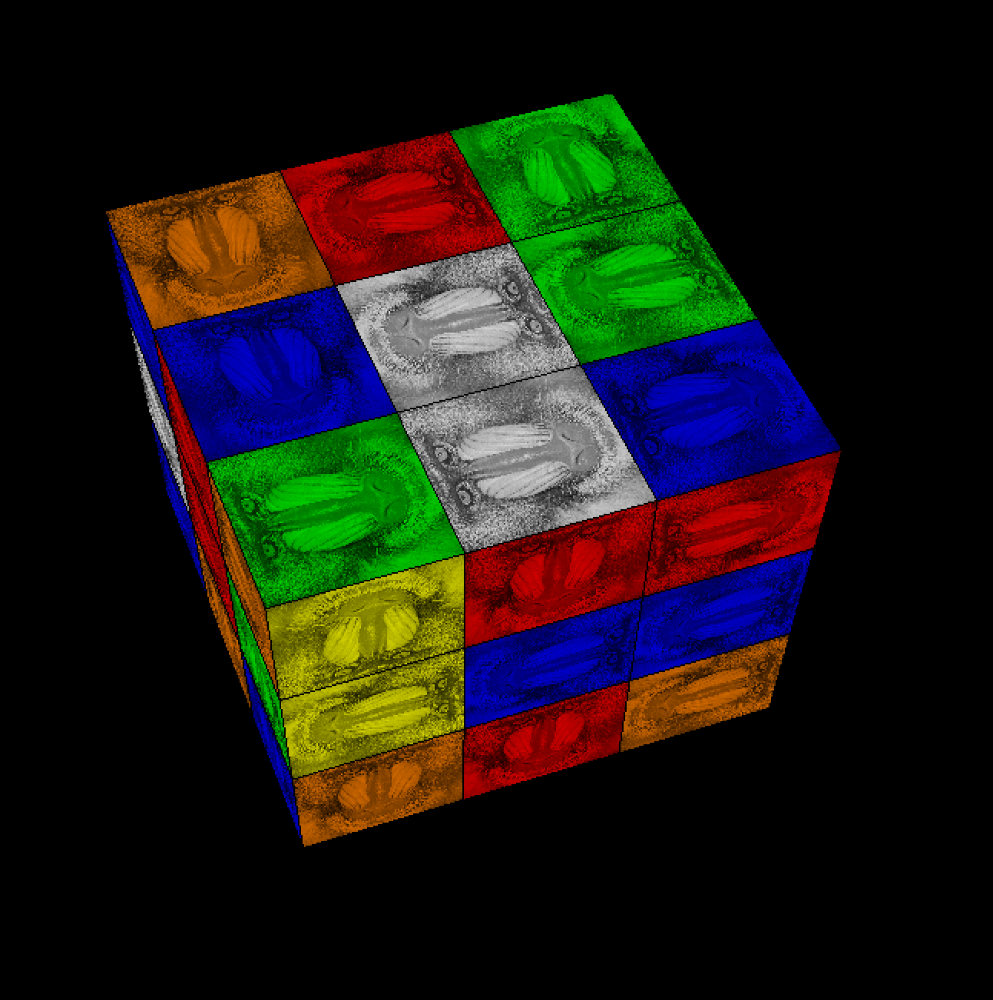
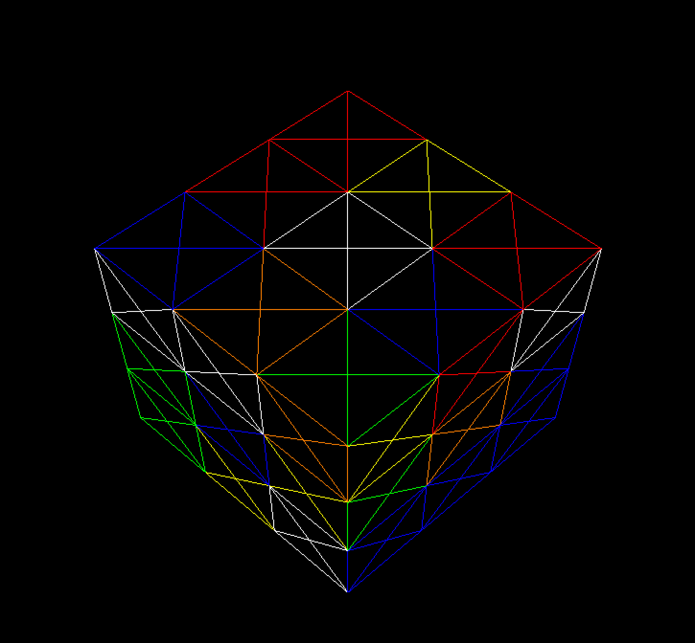
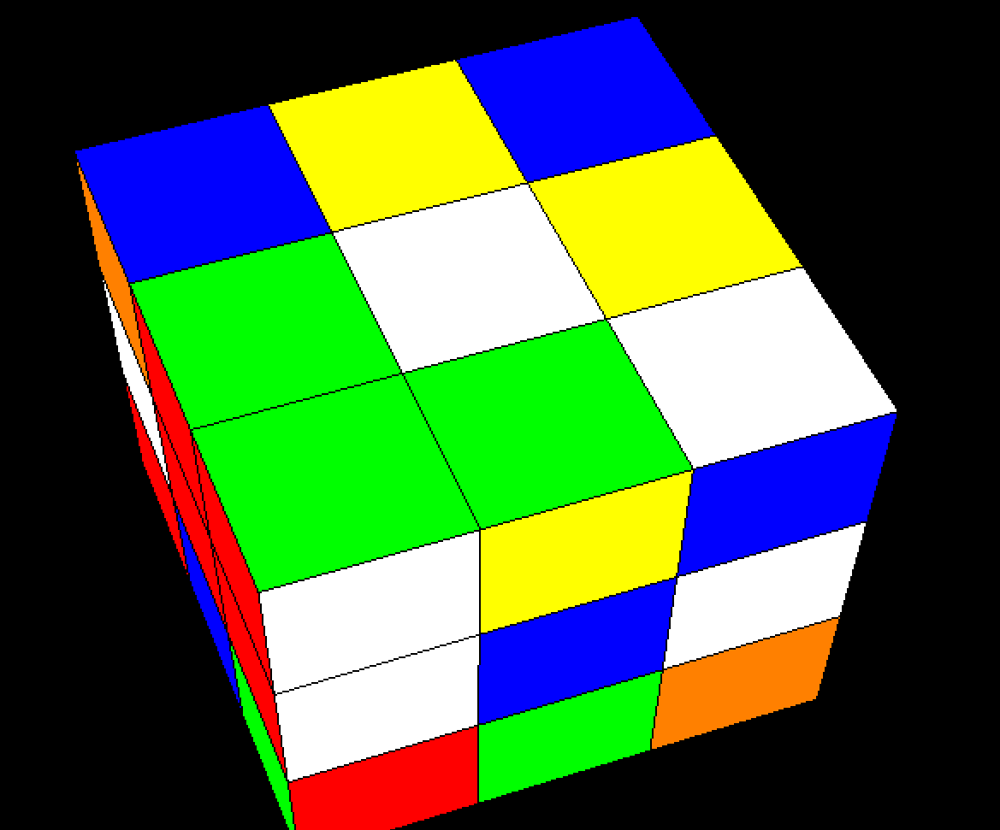
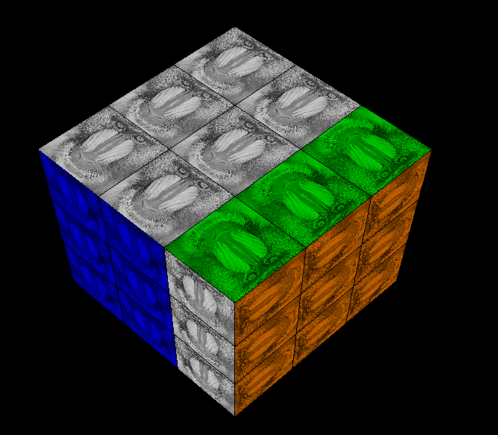
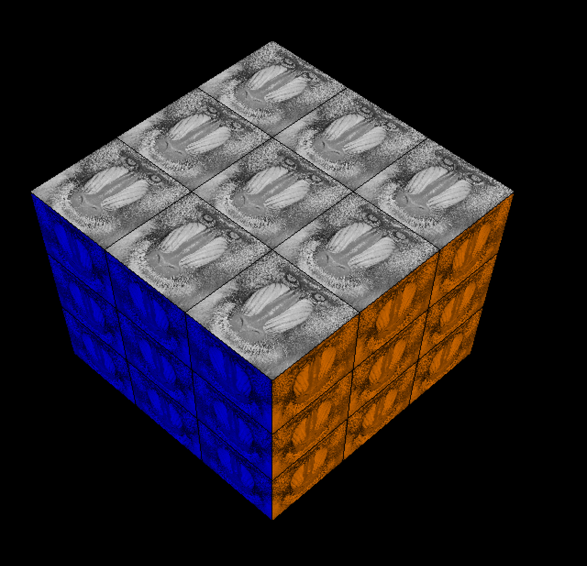

# Project Report

Title: Rubik's Cube

Author(s):
Gianluca Iarrusso
John Barber-Ormerod

Date: 2021/12/07

Check [readme.txt](readme.txt) for  project statement and self-evaluation. 

## R1 Proposal (proposal)
	
### R1.1 Application and problem description

[project proposal](proposal.html)

We were not able to implement rotation animation as well as we would have liked

## R2 Design & implementation (programming)
	
### R2.1 Problem solving and algorithms
We needed to keep track of where each peice was and how we can ensure the cube was solved.
We did this with 2 3X3X3 matrixs the first is a control and where every peice will start and finish,
the second is where the peices are at any given point once the player rotates a side or scrambles
Each cell of the matirx corespondes to a subcube ID specified in World.cpp.
This solution was quite simple but elegant in how we maintain perfect information of the game state at any point.

### R2.2 Completion of the project
Display the Cube

{width=90%}

{width=90%}

{width=90%}

Rotate the  sides

{width=90%}

Play a sound when they move a side and a different sound when you win.

### R2.3 New features
We had a Texture also have a color attached

{width=90%}

We also implemented Keyboard inputs
 

### R2.4 Program design and organization

The Design is that there is a Rubik's Cube in the center of the screen, the user can interact via a menu.
The menu has the following options:
Reset - Reset the cube
Scramble - Scramble the cube
Camera - Rotate the camera on the X, Y, or Z axis
Rotate - Rotate the Top, Bottom, Left, Right, Front or Back Face of the Cube
Shading - Chose between a Wire Structure, Constant Colors or a Colored Monkey face for tile type

The user can also use the Z,X,C,V,B,N Keys to rotate the coresponding face, the face Key pairs are listed in the rotation submenu
The user can also use the R key to rotate the face they last selected in the rotate menu.

The main 3 Files for this program are:
World.cpp - Determines where each sub cube is relative to the world, used for determining the win state
Cube.cpp - Determines what faces of each sub cube to draw
Menu.cpp - handles the rotation of the faces

## R3 Project presentation (document)
	
### R3.1 Project documentation
 
This report is used as document. Alternatively, you can write a separate document in text, md, or html format, and add the link to the file.  

[Project document](document.html)

### R3.2 Project demonstration
 
We demonstrated in Lecture Group 8 Rubik's Cube

**End**